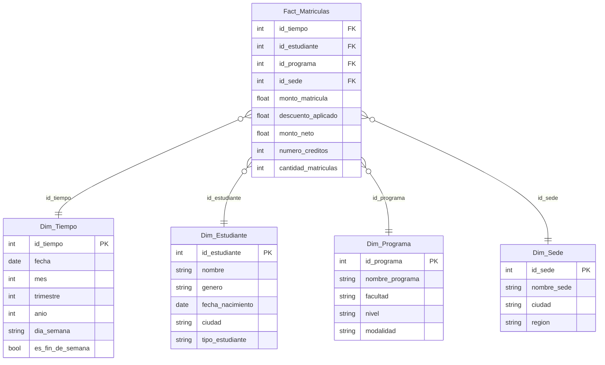

CONFIG
FULL_NAME: Sebastian Bermudez Gutierrez
GITHUB_USER: SebastianBermudezGutierrez

# c1-activity - Diseña un modelo estrella

**Curso:** Inteligencia de Negocios
**Proceso analizado:** Matrículas académicas

## 1. Pregunta de negocio y KPI

La pregunta que me interesa responder es:

> ¿Cuál es el ingreso neto que genera cada programa académico por periodo y qué tan bien estamos captando estudiantes nuevos frente a los que solo se están quedando?

Esto le sirve a la parte financiera y también a admisiones, porque no es lo mismo tener ingresos altos por reingreso que por captación de estudiantes nuevos.

**KPI propuesto:** Ingreso neto mensual por matrículas.

**Meta:** Subir el ingreso neto mensual un 10% respecto al mismo mes del año anterior y que los estudiantes nuevos representen al menos el 30% del total de matrículas de cada periodo.

## 2. ¿Por qué el sistema de origen es OLTP y no se analiza ahí directamente?

El sistema donde un estudiante se matricula (llena el formulario, paga, el sistema le baja el cupo, etc.) es un **OLTP**. Lo identifico como OLTP porque:

- Está pensado para muchas transacciones pequeñas y rápidas (una matrícula a la vez), no para consultas pesadas.
- El modelo de datos está normalizado para no duplicar información y evitar inconsistencias cuando alguien actualiza un dato.
- Le importa más la integridad y la velocidad de escritura que la velocidad de lectura de reportes.

El problema es que si uno intenta sacar reportes históricos directamente sobre esa base de datos:

1. Hay que hacer muchos JOIN entre tablas normalizadas, lo cual es lento.
2. Esas consultas pesadas pueden ponerle lentitud al sistema mientras otros estudiantes se están matriculando en tiempo real.
3. El OLTP normalmente no guarda todo el histórico limpio y organizado para análisis, solo lo necesario para operar.

Por eso ese análisis se debe hacer en un **data warehouse / entorno OLAP**, donde los datos ya vienen desnormalizados en un modelo estrella, pensado para que las consultas de agregación (sumar, agrupar, comparar periodos) sean rápidas. Ese warehouse se llena con un proceso ETL que extrae los datos del OLTP, los limpia y los carga periódicamente (por ejemplo cada noche).

## 3. Modelo estrella

Definí la tabla de hechos con grano de **una fila por matrícula individual** (no por estudiante, ni por programa, sino por cada matrícula que se hace).

### Diagrama estrella

## 4. Dos preguntas que este modelo sí puede responder

1. ¿Cuál fue el ingreso neto total por matrículas por programa y trimestre en 2026?
2. ¿Qué sede tuvo el mayor crecimiento en matrículas de estudiantes nuevos respecto al año anterior?

Las dos se pueden responder solo agrupando `Fact_Matriculas` por las columnas de `Dim_Programa`/`Dim_Tiempo` en la primera, y por `Dim_Sede`/`Dim_Tiempo`/`Dim_Estudiante` en la segunda, sin necesidad de tocar el sistema OLTP.

## Model & questions.

The fact table `Fact_Matriculas` stores one row per individual student enrollment, so it is a transaction-grain fact table. Its main measures are `monto_matricula` (gross tuition amount), `monto_neto` (net revenue after discount), `numero_creditos` (enrolled credits), and `cantidad_matriculas` (a counter used to aggregate the number of enrollments). It connects to four dimensions through foreign keys: Time, Student, Program, and Campus. These dimensions give context so the measures can be sliced by period, student profile, program, or location. With this structure, the model can answer "What was the total net enrollment revenue by program and quarter in 2026?" and "Which campus had the highest growth in new-student enrollments compared to the previous year?" Both questions only require grouping and summing the fact table's measures by dimension attributes, without touching the original OLTP system.
