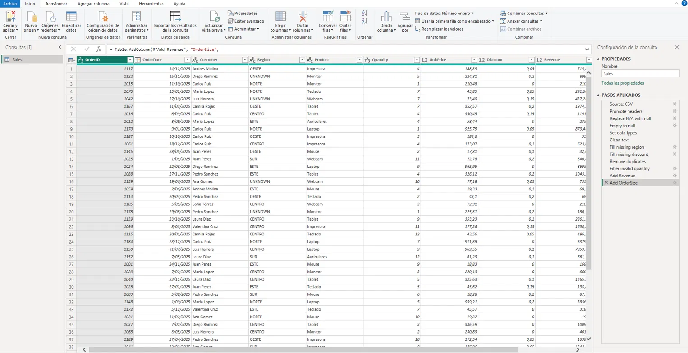
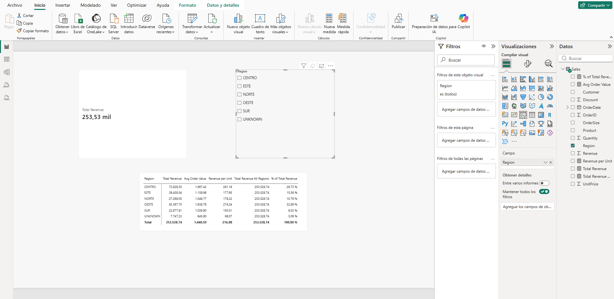
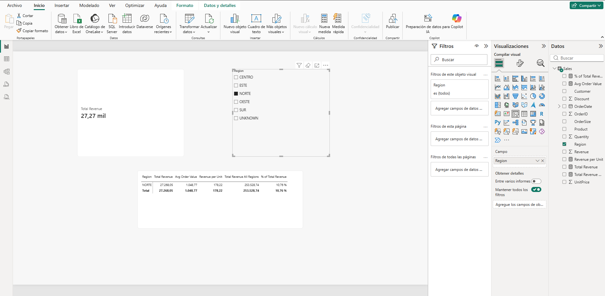

<!--
CONFIG
FULL_NAME: Sebastian Bermudez Gutierrez
GITHUB_USER: SebastianBermudezGutierrez
-->

# Sales Data Cleaning with Power Query & DAX

## Dataset
`data/ventas_sucias.csv`: 202 rows with duplicated orders, inconsistent text, "N/A" placeholders, blank values and invalid quantities.

## Applied steps

## ETL steps & measures

The raw CSV file contained duplicated orders, inconsistent text casing, extra spaces, "N/A" placeholders and invalid quantities, so it was cleaned in Power Query before loading. First, I promoted the headers, replaced "N/A" values with nulls and converted each column to the correct data type (dates, integers and decimals) using the en-US locale so that decimal points were read correctly. Second, I trimmed whitespace and standardized text, using proper case for customer names and uppercase for regions, and replaced missing regions with "UNKNOWN" and missing discounts with 0. Third, I removed duplicate rows based on OrderID and filtered out rows with zero or negative quantities, which reduced the table from 202 to 176 rows. Finally, I added a calculated column called Revenue (Quantity × UnitPrice × (1 − Discount)) and a conditional column called OrderSize that classifies each order as Small, Medium or Large.

After loading the data into the model, I created three DAX measures: Total Revenue, which uses SUM over the Revenue column; Avg Order Value, which uses AVERAGE; and Revenue per Unit, which uses DIVIDE to calculate Total Revenue over total quantity and safely handles division by zero. I also added Total Revenue All Regions, which uses CALCULATE with ALL, and % of Total Revenue, which divides each region by that grand total.

## Filter context

The measure formulas never change; what changes is the filter context. With no slicer selection, Total Revenue is evaluated over all 176 rows and returns 253,528.74. When NORTE is selected in the slicer, Power BI filters the Sales table to that region before evaluating SUM, so the card shows 27,268.05. In the matrix, each row recalculates the same measure for its own region. Total Revenue All Regions stays at 253,528.74 because ALL removes the region filter, which is why % of Total Revenue correctly shows 10.76% for NORTE.